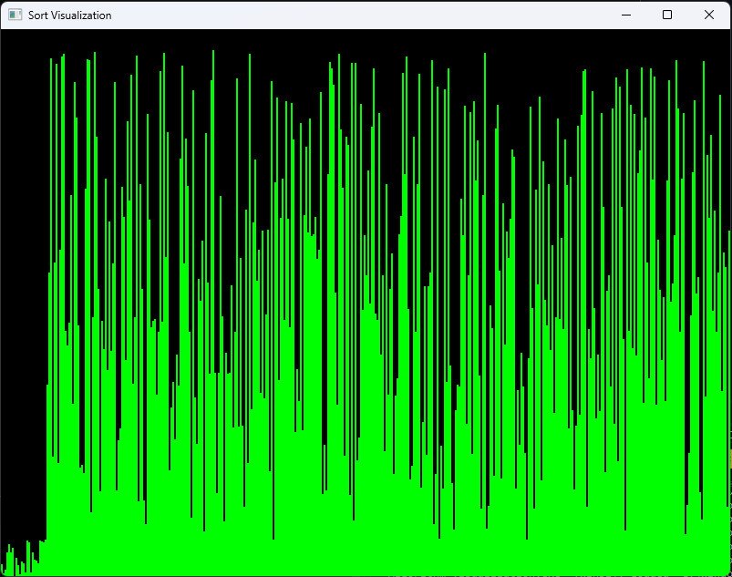

# Sort Algorithm Visualization

This project visualizes various sorting algorithms using the Simple and Fast Multimedia Library (SFML). 

  <!-- Add this line to reference your uploaded image -->

## Features

- **Real-time Visualization**: Watch as the Quick Sort algorithm sorts an array of numbers.
- **Dynamic Bar Heights**: Each bar represents a value in the array, with heights corresponding to their values.
- **Adjustable Speed**: Control the speed of the sorting animation by modifying the `VISUALIZATION_DELAY_MS` constant in the code.

## Requirements

- C++ Compiler
- [SFML](https://www.sfml-dev.org/) library

## Installation

1. **Clone the repository**:
   ```bash
   git clone https://github.com/AhmedSamyMousa/Sort-Algorithm-Visualization.git
   cd Sort-Algorithm-Visualization
